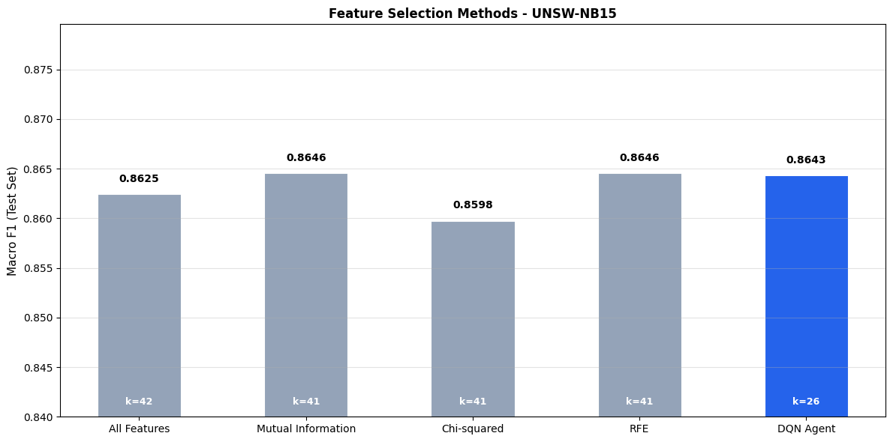
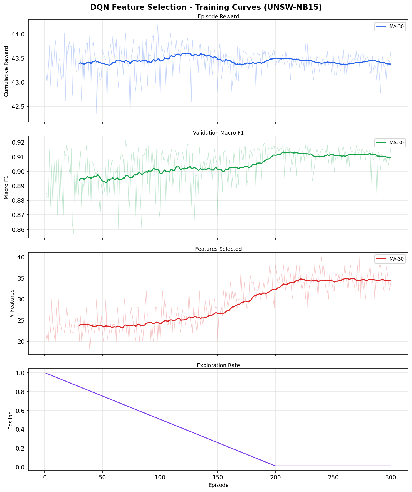
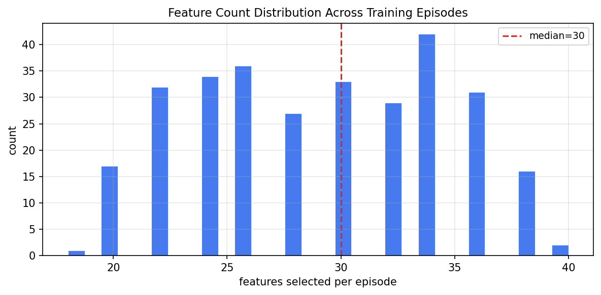

# DQN Feature Selection - UNSW-NB15

Trained a Double DQN agent to automatically find a good feature subset for network intrusion detection on UNSW-NB15. The agent toggles features on/off and gets rewarded for high F1 with fewer features selected.

## Results

| Method | Features | Accuracy | Macro F1 |
|---|---|---|---|
| All Features | 42 | 0.8690 | 0.8625 |
| Mutual Information | 41 | 0.8708 | 0.8646 |
| Chi-squared | 41 | 0.8666 | 0.8598 |
| RFE | 41 | 0.8708 | 0.8646 |
| **DQN Agent** | **26** | **0.8708** | **0.8643** |

Traditional methods needed 41/42 features to get their best score. The DQN agent matched that with 26 features, a 38% reduction.





## Dataset

UNSW-NB15 benchmark split - 175,341 train / 82,332 test.
Download from: https://research.unsw.edu.au/projects/unsw-nb15-dataset

Put these two files in data/:
- UNSW_NB15_training-set.csv
- UNSW_NB15_testing-set.csv

## Setup

```bash
python -m venv venv
venv\Scripts\activate
pip install -r requirements.txt
```

## Run

```bash
python src/01_preprocess.py
python src/02_baselines.py
python src/03_train_dqn.py
python src/04_evaluate.py
python src/05_plots.py
```

## Reward

R = F1_val - lambda * (features_selected / total_features)

Higher F1 is better, more features selected means a bigger penalty.

## Agent

Double DQN - standard DQN overestimates Q-values because it uses the same network to pick and score actions. Double DQN splits that: online network picks the action, target network scores it. Target syncs every 10 episodes.

Network: 42 -> 128 -> 128 -> 64 -> 42

## Files

```
dqn-feature-selection/
├── data/
│   └── put UNSW CSVs here
├── src/
│   ├── 01_preprocess.py
│   ├── 02_baselines.py
│   ├── 03_train_dqn.py
│   ├── 04_evaluate.py
│   ├── 05_plots.py
│   ├── env.py
│   ├── agent.py
│   └── config.py
├── results/
│   └── plots and saved model go here
└── requirements.txt
```